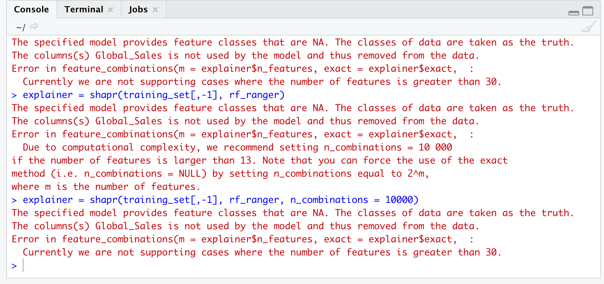

```{r setup, include=FALSE}
knitr::opts_chunk$set(echo = TRUE)
library(corrplot)
library(fastDummies)
library(tidyverse)
library(randomForest)
library(iml)
library(ranger)
library(shapr)
library(lime)
library(gridExtra)

```

# Introduction

The aim of this project is to predict the sales of video games using random forest. The dataset contains video game sales until 2016, obtained from Kaggle. 
Additionally we wish to apply some of the techniques from the XAI part of the course to explain which covariates are the most important in the prediction, since random forests is an ensemble type of method and not interpretable.
We give some explanation of the dataset along with summary of how the dataset has been treated. We present some exploratory analysis of the dataset. First we divide the dataset into train and test set and apply the random forests, second we explore the importance of the covariates using XAI methods. Finally, we discuss the intepretation and results, and conclude the report.

# Dataset and its preparation

Preparation of the dataset can be found in a separate .R file in the repository labelled as "data_cleaning.R".
We give a summary of the way we proceeded to clean it and impute some of the missing data.

Firstly we removed the columns which are not entering our data analysis, which are the other types of sales that are not Global, and these are North American, Japenese, European and Other sales. Secondly we removed the rows for which both the critics score and the user score, as well as the counts are empty, tba or NA. 
Next step was to add the missing year of release, as there were not too many observations missing this covariate after the previous removals, and it is possible to obtain this information. There were between 150 and 200 rows missing the year of release, and these were added manually.

There have been some rows where either the critic- score and count or the user- score and count where values of entries were either empty, to be determined (tbd) or simply NA. In such cases, we have chosen to imputed values. This has been based on the mean of the covariate in question, for which the critic score (in case of imputing user score and count) or user score (in case of imputing critic score and count) is between the current critic score value of the element +/-5 (for more details see data_cleaning.R).  

For some of the other columns which were just missing a few entries (less than 10), we added these in to the existing Unknown category. 

The covariate Name is not included in the statistical analysis.

Here we present the covariates as they are, before the dummy variable coding is conducted for the statistical (and exploratory data) analysis:

 - Platform: Gaming platform, 17 different categories  
 - Year of Release: When the video game was releases, ranges from 1985 to 2016  
 - Genre: type of the video game, 12 different categories  
 - Publisher: which studio published the game, 310 different publishers  
 - Global Sales: how much the game was sold, ranges from \$0.01m to \$82.53m  
 - Critic Score: evaluation of the critics, ranges from 13 to 98 (out of 100) 
 - Critic Count: number of critics that reviewed the game, ranges from 3 to 113 
 - User Score: evaluation of the game by user, ranges from 0 to 9.7 (out of 10)
 - User Count: number of users that reviewed the game, ranges from 4 to 10665
 - Developer: studio that developed the game, 1516 different developers
 - Rating: ESBR rating of the game, 6 different categories

More details on the covariates are presented in the next section.


The covariates that are turned into dummy variables for the analysis later are Genre, Publisher, Delevoper and Platform. Rating is not made into a dummy variable as it has very few categories.

There are in total 8706 observations in this cleaned dataset.
There might be some inconsistencies when it comes to some entries in the dataset. For example, we have observed that the publisher for one of the titles was incorrect. These have not been corrected and we have not actively looked for such inconsistencies. 

Although random forest is a tree based method, surrogate splitting to handle missing data is not advised (see http://arxiv.org/pdf/0811.1645.pdf).

# Exploratory analysis


First we present the summary of the dataset, before it is dummy coded.

```{r echo=FALSE}

ds_vgs_expl_analysis <- as.data.frame(read.csv("vgs_22_2016_expl_analysis.csv"))
ds_vgs_expl_analysis <- subset(ds_vgs_expl_analysis, select = -c(X.1,X))
summary(ds_vgs_expl_analysis)
```


We observe that the mean and the median of the sales are quite far apart, meaning that there are most probably a few games that have sold considerably more than others, and that it is more common for games to not sell that well, which makes sense. Additionally we can see that there are more users reviewing games than critics, both looking at mean and median, which also makes sense. 


```{r echo=FALSE, fig.cap= "Correlation plot between the numerical variables."}

corrplot(cor(ds_vgs_expl_analysis[c(3,6:10)]), tl.cex = 1)
```

Looking at the first correlation plot in Figure 1,  we observe that user score and critic score have the highest correlation among the covariates. This is logical as normally, a good critic score and review indicates the quality of the game, and it is probable that the users are also going to review the game favourably. User count is also negatively correlated with year of release, which could mean that either quality of the games have decreased, or that the number of games made has increased, and that more of them are of poorer quality. Concerning Critic Count and User Count, it is no surprise that these covariates are positively correlated with Year of Release due to improvement in technology and the reviewing culture, meaning it has become much easier and more accessable to review games (and other things) in the recent years. Critic score and critic count are positively correlated as well, as expected, the games with higher score are usually very popular meaning that a lot of critics (and users) review them. Finally, and again unsurprisingly enough, global sales are positively correlated with user count, critic count and critic score. The more people review the game, the more have bought it and the more positive reviews are, the more people are going to buy the game.


```{r echo=FALSE, fig.cap="Correlation plot for genre that has been dummy coded and the other numerical variables."}
ds_vgs_imputed_corr_genre <- dummy_cols(ds_vgs_expl_analysis, select_columns = "Genre")
corrplot(cor(ds_vgs_imputed_corr_genre[c(3,6:10,13:24)]), tl.cex=0.8)
```

Now we have a look at a correlation plot in Figure 2, with added dummy variables for game genres. Here we comment on some of the relations that can be observed from the plot. We observe that there is positive correlation between action genre and year of release and negative between platform, racing, sports and year of release. This most probably means that there have been released more games of the action genre and less of the other three. We also see that more critics and users review shooter and role-playing games, as the correlation is slightly positive, and they review less of the other genre. 

```{r echo=FALSE, fig.cap="Correlation plot for genre and platform types that have been dummy coded and other numerical variables."}
ds_vgs_imputed_corr_platform <- dummy_cols(ds_vgs_expl_analysis, select_columns=c("Platform", "Genre"))

corrplot(cor(ds_vgs_imputed_corr_platform[c(3,6:10,13:41)]), tl.cex = 0.5)

```

Looking at the final correlation plot in Figure 3, we will comment on some of the interesting relationships shown. We see various correlations between the platforms and year of release, and this, of course, is related to the amount of time each of the platforms have been in use. We see that Xbox360 has positive correlation with the critics count, meaning critics reviwed a lot of games made for this platform. We observe the same for the relationship between User Count and PC platform. We also see some positive correlations between certain genres and platforms, meaning there have been developed more games of those specific types for the platforms in question. 


Due to their rather large number, the different developers and publishers are not included in any of the correlation plots (it was also not possible to visualize it or see anything, graphically).

```{r include=FALSE}

sum_sales_genre <- ds_vgs_expl_analysis %>% group_by(Genre) %>% summarise(sum_gs = sum(Global_Sales))
sum_sales_developer <- ds_vgs_expl_analysis %>% group_by(Developer) %>% summarise(sum_gs = sum(Global_Sales))
top_sales_developer <- top_n(arrange(sum_sales_developer,desc(sum_gs)),10)
sum_sales_publisher <- ds_vgs_expl_analysis %>% group_by(Publisher) %>% summarise(sum_gs = sum(Global_Sales))
top_sales_publisher <- top_n(arrange(sum_sales_publisher,desc(sum_gs)),10)
```

```{r echo=FALSE, fig.cap="Number of games released each of the given years.", out.width = '80%', fig.align="center"}
year_count <- count(ds_vgs_expl_analysis, Year_of_Release)

# Released games each year
ggplot(data=year_count, aes(x=Year_of_Release,y=n)) + geom_line()+ggtitle("Number of games released as a function of year of release")
```

In Figure 4  we see the number of video games released each year. The number starts out low in the begining, and we suspect this is due to the low number of video games registered in the dataset from this period. The number proceeds to increase until it peaks around 2008, and has been decreasing since. The decrease can perhaps be explained with there being fewer games that are larger, meaning more effort is put in developing them, with demanding graphics with large amount of possible play hours. 

```{r echo=FALSE, fig.cap="The tile plot where showing number of games for each combination of platform and genre.", out.width = '80%', fig.align="center"}

# platform and genre
plat_genre <- count(ds_vgs_expl_analysis, Genre, Platform)


ggplot(plat_genre, aes(x=Genre, y=Platform, fill=n)) + geom_tile() + ggtitle("Tile plot of number of games for genre x platform") + theme(text = element_text(size=8))
```

Figure 5 shows the number of games released for each combination of genre and platform. We observe that the Action and Sports are genres with a lot of games for PS2 (Playstation 2) and the Action genre has a lot of games released for Xbox360 and PS3 as well. Usually the same games are released on multiple platform so this is not surprising. We also observe that some genres are not represented on certain platforms. We see that most games released for PC platform are from genres like Strategy, Shooter and Action. 

```{r echo=FALSE, fig.cap="Sum of global sales per video game genre.", out.width = '80%', fig.align="center"}
# Total number of sales per genre 


ggplot(sum_sales_genre, aes(x=Genre, y=sum_gs)) + geom_col() + ggtitle("Sum of global sales per genre") + theme(text = element_text(size=8))
```

In Figure 6 we see the total global sales shown per genre. We see that the most selling genres are Action, Sports and Shooter, which is not very surprising, as these genres have the largest number of games released. 

```{r echo=FALSE, fig.cap="Sum of global sales for each developer, here top ten developers with highest global sales shown.", out.width = '80%', fig.align="center"}
# Total number of sales per genre 

ggplot(top_sales_developer, aes(x=Developer, y=sum_gs)) + geom_col() + ggtitle("Top ten developers with highest overall global sales") + theme(text = element_text(size=8))
```

Figure 8 shows top ten developers with the highest number of total global sales. We see here that Nintendo tops this list, followed by EA Sports (the FIFA series) and Rockstar North (the GTA series).

```{r echo=FALSE, fig.cap="Global sales per publisher, here top ten publisher with highest global sales shown.", out.width = '80%', fig.align="center"}

ggplot(top_sales_publisher, aes(x=Publisher, y=sum_gs)) + geom_col() + ggtitle("Top ten publishers with highest overall global sales") + theme(text = element_text(size=4))

```

Figure 8 shows top ten publishers with highest total global sales. Here we see again EA on the top of the list, along with Nintendo. These two companies both develop and publish games. Following are publishers like Activision (most famous for publishing Call of Duty) and Sony Computer Entertainment (published a lot of succesful titles for Playstation). 


\newpage 

# Statistical Analysis
### Random forest

```{r echo=TRUE}

set.seed(1337)
#Load dat set
vgs_data_set  = as.data.frame(read.csv("vgs_22_2016_cleaned_dummied_final.csv", header = TRUE))
vgs_data_set = subset(vgs_data_set, select = -c(X))

# Calculate the size of the data set:
data_set_size = floor(nrow(vgs_data_set))
# Generate a random sample of "data_set_size" indexes. We decide on an 80/20 split
indexes = sample(1:data_set_size, size = data_set_size*0.8)
# Assign the data to the correct sets
training_set = vgs_data_set[indexes,]
test_set = vgs_data_set[-indexes,]

```

Due to lenghty run- and compiling-time, we decide to only tune the ntree hyperparameter, setting the mtry hyperparameter to the rule of thumb N_features/3 for regression random forest. We tune ntree by creating a set of (mostly) evenly spaced values, then training a random forest for each value, then comparing the out-of-bag MSE to pick the model with the best performance. This is an alternative approach one can use instead of doing cross validation, as tree based methods involving bootstrapping naturally leave parts of the bootstrapped training data unused, which is perfect for validation (it is also faster than cross validation, which is a boon in this case).

```{r eval=FALSE, include=TRUE}
set.seed(1337)
# OOB validation of ntrees-hyperparameter
tree_sizes = c(50,100,200,300,400,500)
tree_size_OOB = lapply(tree_sizes, function(x){
  model = randomForest(Global_Sales ~ . - Name, data=training_set, ntree=x, mtry=floor((ncol(vgs_data_set)-1)/3), importance=TRUE)
  oob_mse = tail(model$mse,1)
  return(oob_mse)
})
tree_size_OOB

```

If we run the chunk above, we see that the lowest OOB-error comes from the model with nrtree=400. We therefore pick ntree=400, and proceed fitting our model.

```{r, echo=TRUE}
set.seed(1337)
# Train random forest
old_time = Sys.time()
rf_model = randomForest(Global_Sales ~ . - Name, data=training_set, ntree=400, mtry=floor((ncol(vgs_data_set)-1)/3), importance=TRUE)
time_length = Sys.time() - old_time

```

We test our model on the held-out test set

```{r, echo=TRUE}
test_pred = predict(rf_model, test_set)
sqrt(mean((test_pred - test_set$Global_Sales)**2))

```

A root mean square error of 2.09 is not really anything to write home about, especially when we know that about 85 percent of the games have sold less than 1 million. Nonetheless, we still wish to explain why our model makes the choices that it does during prediction.

### XAI

Since random forest is an ensamble-based method, it is difficult to interpret why the model predicts the results that it does. We must here rely on external techniques from the XAI-part of the course to be able to explain the model's decisions. A natural starting point is the the Gini importance plot, which is exclusive to tree-ensamble based methods like random forest and XGBoost, as these methods might use the Gini index as a splitting criterion. The Gini importance plots presents a rating of which features the random forest consideres the most important, related to how pure the nodes would be if the feature was excluded.

```{r echo=FALSE}
varImpPlot(rf_model, type=2)

```

From the Gini importance plot, we observe that our random forest model puts the most importance on User_Count and Critic_Score, followed by Developer_Nintendo and Critic count, then Year_of_Release and User_Score, before starting to somewhat drop off. User_Count immediately makes some sense; if more poeple score a game, you would expect that most of these people have also bought the game (although it is not given, of course). Critic_Score is also understandable; if "professional" video-game reviewers all rate the game highly, it is likely a good game, and will probably also sell well. Some might even buy the game solely based on the fact that it is highly rated. Developer_Nintendo is also not a surprise, as the company is known for developing strong 1st party titles for their consoles, that all mostly sell well. It is worth mentioning that a few other developers and publishers also show up on the importance plot: Rockstar.North, developer of the GTA-series, Inifinity.Ward and and Activison, who develope and publish the Call of Duty series, Game.Freak, who developes the Pokemon games, to name a few. These are all widely succesfull titles, and all sell exceedingly well. (even though the quality of the games have declined over the years, according to some. But this would only go to show that brand names sell.) Critic_Count is the last covariate before a somewhat sharp drop off in importance. Not as intuitive as the others, it is possible that games that sell well also attracts more reviewers. As observed earlier in the correlation plot between features, Critic_Score is correlated with Critic_Count, so this is not too unlikely of an idea. (We could go on and on here, noting how some genres and platforms also seem to be more important than others, but for the sake of report length, we stop after the first four.)

To expand upon the importance plot, we utilise the Accumulated Local Effects plot (ALE) to see if our initial intuitive explanation of the important features of the importance plot is sound. We might also learn more about the importance of the features. The ALE plot is generated by fixing all other features, then varying the feature of interest over all possible values in the data set. We begin be inspecting the feature User_Count. We use the ALE plot instead of the PD plot due to the fact that multiple of our features seems to be correlated, something the ALE plot is able to handle better than the PD plot.

```{r, echo=TRUE}
mod = Predictor$new(rf_model,data = training_set)
eff = FeatureEffect$new(mod,feature="User_Count",method="ale")
plot(eff)

```

As we expected, the more users reviewing the game, the better the game sells. At what seems like ~500 user reviews, the predicted amount of sales is 1 million more than the average prediction, before increasing in a linear fashion afterwards (somewhat surprising). We see that for User_Count lower than say 1500, there is a higher density of different values of number of user reviews, and the games with an incredible number of user reviews are in fewer numbers, but nonetheless, as long as the number of reviews is not very small, there's still a positive addition to the predicted Global_Sales, compared to the average.

```{r, echo=TRUE}
eff = FeatureEffect$new(mod,feature="Critic_Score",method="ale")
plot(eff)

```

Critic_Score also behaves as expected. There seems to a sweet spot around 90/100, from where the sales starts to really take off. Surprisingly, it seems that the Critic_Score must be almost 80/100 before it starts to influence the sales in a positve way. Anything less, and the predicted sales are less than average, although not by much. This is quite an interesting result, and one could possibly try to explain this by referring to the informal saying "70/100 is the new average". This refers to the percieved tendency that video game reviewers give inflated scores, and that a game of old with a score of less than 50/100 would today have recieved closer to a 70/100. Perhaps there is some truth to this, given that any score less than 80/100 seems to have a negative influence of the prediction, compared to the average.

```{r, echo=TRUE}
eff = FeatureEffect$new(mod,feature="Critic_Count",method="ale")
plot(eff)

```

The Critic_Count feature also behaves approximately how we assumed earlier, with not too much else of interest to discuss. Due to curiosity, we plot all the Genre-features, to see if the various genres affects the predicted sales in any way.

```{r, echo=TRUE}
fe_list = list()
j=1
for (i in 1852:1863){
  eff = FeatureEffect$new(mod,feature=colnames(test_set[i]),method="ale")
  fe_list[[j]] = plot(eff)
  j = j + 1
}
grid.arrange(fe_list[[1]],fe_list[[2]],fe_list[[3]],fe_list[[4]],fe_list[[5]],fe_list[[6]],fe_list[[7]],fe_list[[8]],fe_list[[9]],fe_list[[10]],fe_list[[11]],fe_list[[12]],ncol = 4,nrow=3)

```

From this plot, we see that there is not too much change, based on the various genres. Racing is the genre that affects the prediction in the strongest postive way, followed by Sports and Misc. Not too unreasonable, as both Racing- and Sports-games are popular with both youngsters, teens and younger adults (perhaps mostly males), an important demographic when it comes to video game sales. We see that Role.Playing and Strategy affects the prediction in a negative way. These are perhaps a bit more niche categories, and might explain the negative effect.

It would have been very interesting to see the explanation for why the model underpredicts the Global_Sales for e.g. the Wii sports game (idx 1 in test_set, which sold very well), but it seems we picked the wrong random forest library for that, as neither lime nor shapley supports randomForest, at least not without jumping through some hoops(we were not aware of the fact that only a few model objects were supported). We therefore fit a random forest model from the ranger library as well, so that we are able to use some of the local XAI techniques. For simplicity, we pick the same hyperparameters, even though the num.trees was validated using the model from the other library.

```{r, echo=TRUE}
set.seed(1337)
rf_ranger = ranger(formula = Global_Sales ~ . - Name, data=training_set, num.trees=400, mtry=floor((ncol(vgs_data_set)-1)/3), importance="impurity")

test_pred_ranger = predict(rf_ranger, test_set)
sqrt(mean((test_pred_ranger$predictions - test_set$Global_Sales)**2))

```

Test error is pretty similar, compared to the randomForest implementation.

```{r, echo=TRUE}
sort(rf_ranger$variable.importance, decreasing =TRUE)[1:10]

```

Variable importance seems to mostly favour the same features, although the importance of Platform_PC and Platform_Wii is switched. Values seem to mostly agree with the varImpPlot of the randomForest model. This is somewhat reassuring, but ideally, one model should've been used the whole way (but again, we were not aware of the limitations of the local XAI libraries). The upcoming analysis will therefore be valid for this new ranger model, and perhaps not as valid for the randomForest one.

```{r, echo=TRUE}
idx = 1
test_set[idx,1] # Name of game
test_set[idx,3] # Global sales
predict(rf_ranger, test_set[idx,])$predictions # Pred sales

```

Underpredicts with around 70 million sales, that's quite a lot!

```{r eval=FALSE, include=TRUE}
explainer = shapr(training_set[,-1], rf_ranger, n_combinations = 10000)
p = mean(training_set$Global_Sales)
explain = shapr::explain(test_set[1,-1],
                         explainer,
                         approach ="ctree",
                         prediction_zero =p,
                         mincriterion =0.95,
                         minsplit =20,
                         minbucket =7,
                         sample=TRUE)
plot(explain)

```

Unfortunately, shapr does not support cases where the number of features are greater than 30 (we get errors, see picture below), so we're not able to do this anyway...

```{r, out.width="50%"}


```

```{r eval=FALSE, include=TRUE}
explainer = lime(training_set,
                        model= rf_ranger,
                        bin_continuous = TRUE,
                        n_bins = 10,
                        quantile_bins=TRUE)
explanationLime = explain(test_set[1,-1],
                           explainer = explainer,
                           n_features = 10,
                           n_permutations = 5000,
                           feature_select = "auto",
                           kernel_width = 3)
plot_features(explanationLime, ncol = 2)

```

Sadly, lime does not work (either) in our case. Googling the error message leads us to a github thread dated 2019, where the issue is suspected to be due to feature columns with 0 variance. Due to our dummy coding, there may be quite a few cases in our training data set where some of the developer/publisher dummy coded features all have 0 value (eg.g in the cases where a developer has only developed 1-2 games, and they all happen to be in our test set due to our split). Maybe this could be circumvented if we had manually removed publishers/developers with very few games, or tweaked our train/test-split so that no feature column has zero variance in the training data set. This is only speculations, though, and we find it unfortunate that both shapr and lime struggle to accommodate models that are not "nice" enough.

# Conclusion 

We are not overly impressed by the accuracy of the random forest model, but the data set has a lot of features after dummy coding, so it is perhaps not unsurprising. The XAI techniques reveals results that mostly agrees with our intuition, while also providing some new insight. We are overall a bit dissappointed with the shortcomings of the shapr and lime packages.


# References
[1]: "Video Games Sales Dataset"  - https://www.kaggle.com/sidtwr/videogames-sales-dataset   
[2]: corrplot package - https://cran.r-project.org/web/packages/corrplot/corrplot.pdf  
[3]: tidyverse package - https://cran.r-project.org/web/packages/tidyverse/tidyverse.pdf  
[4]: fastDummies package - https://cran.r-project.org/web/packages/fastDummies/fastDummies.pdf  
[5]: randomForest package - https://cran.r-project.org/web/packages/randomForest/randomForest.pdf  
[6]: iml - https://cran.r-project.org/web/packages/iml/iml.pdf  
[7]: ranger - https://cran.r-project.org/web/packages/ranger/ranger.pdf  
[8]: lime - https://cran.r-project.org/web/packages/lime/lime.pdf  
[9]: shapr - https://cran.r-project.org/web/packages/shapr/shapr.pdf  
[10]: gridExtra - https://cran.r-project.org/web/packages/gridExtra/gridExtra.pdf  
In addition, all the dependencies were loaded as well for the packages mentioned above to work.
These are not listed in detail.


